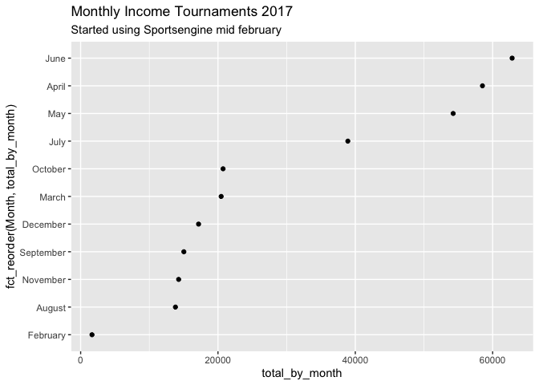
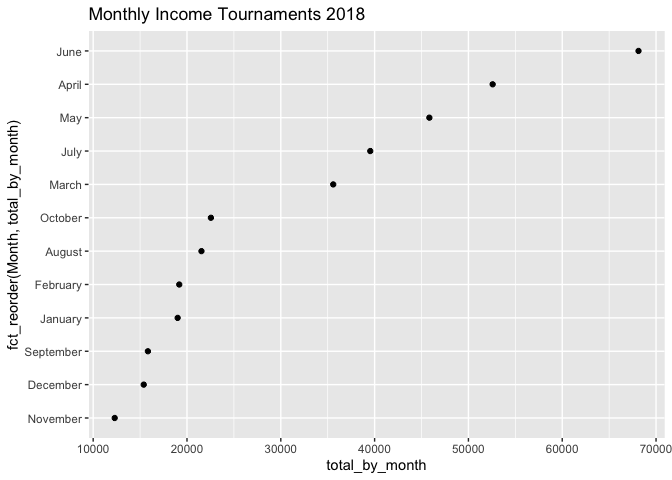
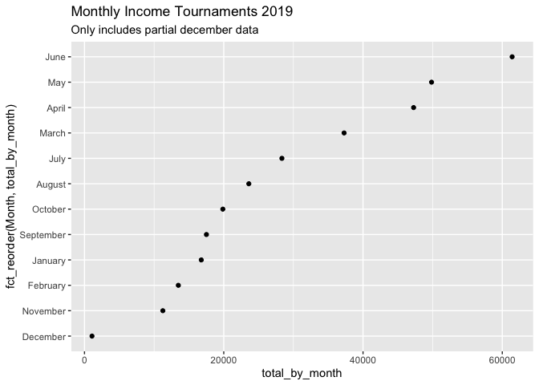

Alodia Project
================
Mark Kinyanjui
1/16/2020

## R Markdown

This project attempts to look at Alodia data collected through
Sportsengine registration system since 2017 to identify trends, make
valuable decisions and to be used as a potential marketing tool

## Dataset & Packages

## Tournament Breakdown

Let’s see if we can see which months are the busiest by year for
tournaments

``` r
names(tournaments)
```

    ##  [1] "Team Name"               "Gender"                 
    ##  [3] "Grade (4th-12th)"        "Address 1"              
    ##  [5] "City"                    "State"                  
    ##  [7] "Zip"                     "Country"                
    ##  [9] "Tournament Registration" "Month"                  
    ## [11] "Entry Number"            "Registration Date"      
    ## [13] "Order Number"            "Account Email"          
    ## [15] "Net"                     "Year"

``` r
library(dplyr)
```

    ## 
    ## Attaching package: 'dplyr'

    ## The following objects are masked from 'package:stats':
    ## 
    ##     filter, lag

    ## The following objects are masked from 'package:base':
    ## 
    ##     intersect, setdiff, setequal, union

``` r
library(tidyverse)
```

    ## ── Attaching packages ─────────────────────────────────────── tidyverse 1.2.1 ──

    ## ✔ ggplot2 3.2.1     ✔ readr   1.3.1
    ## ✔ tibble  2.1.3     ✔ purrr   0.3.3
    ## ✔ tidyr   1.0.0     ✔ stringr 1.4.0
    ## ✔ ggplot2 3.2.1     ✔ forcats 0.4.0

    ## ── Conflicts ────────────────────────────────────────── tidyverse_conflicts() ──
    ## ✖ dplyr::filter() masks stats::filter()
    ## ✖ dplyr::lag()    masks stats::lag()

``` r
### Table for totals by month 
tournaments %>%
  select(`Team Name`,`Grade (4th-12th)`,`Tournament Registration`, Gender, Month,Year, `Registration Date`,`Account Email`, Net) %>%
  group_by(Month,Year) %>%
  summarise(Total_by_month = sum(Net , na.rm = TRUE)) %>%
  arrange(Total_by_month) 
```

    ## # A tibble: 35 x 3
    ## # Groups:   Month [12]
    ##    Month      Year Total_by_month
    ##    <chr>     <dbl>          <dbl>
    ##  1 December   2019          1078.
    ##  2 February   2017          1653.
    ##  3 November   2019         11251.
    ##  4 November   2018         12295.
    ##  5 February   2019         13478.
    ##  6 August     2017         13804.
    ##  7 November   2017         14273.
    ##  8 September  2017         15030.
    ##  9 December   2018         15388.
    ## 10 September  2018         15834.
    ## # … with 25 more rows

``` r
### Visualizing the monthly income for tournaments 
tournaments %>%
  select(`Team Name`,`Grade (4th-12th)`,`Tournament Registration`, Gender, Month,Year, `Registration Date`,`Account Email`, Net) %>%
  group_by(Month,Year) %>%
  summarise(total_by_month = sum(Net ,na.rm = TRUE)) %>%
  arrange(total_by_month) %>%
  filter(Year == 2017) %>%
  ggplot(aes(total_by_month, fct_reorder(Month,total_by_month))) + geom_point()+
  ggtitle("Monthly Income Tournaments 2017", subtitle = "Started using Sportsengine mid february")
```

<!-- -->

``` r
tournaments %>%
  select(`Team Name`,`Grade (4th-12th)`,`Tournament Registration`, Gender, Month,Year, `Registration Date`,`Account Email`, Net) %>%
  group_by(Month,Year) %>%
  summarise(total_by_month = sum(Net ,na.rm = TRUE)) %>%
  arrange(total_by_month) %>%
  filter(Year == 2018) %>%
  ggplot(aes(total_by_month, fct_reorder(Month,total_by_month))) + geom_point()+
  ggtitle("Monthly Income Tournaments 2018")
```

<!-- -->

``` r
tournaments %>%
  select(`Team Name`,`Grade (4th-12th)`,`Tournament Registration`, Gender, Month,Year, `Registration Date`,`Account Email`, Net) %>%
  group_by(Month,Year) %>%
  summarise(total_by_month = sum(Net ,na.rm = TRUE)) %>%
  arrange(total_by_month) %>%
  filter(Year == 2019) %>%
  ggplot(aes(total_by_month, fct_reorder(Month,total_by_month))) + geom_point()+
  ggtitle("Monthly Income Tournaments 2019", subtitle = "Only includes partial december data")
```

<!-- -->
